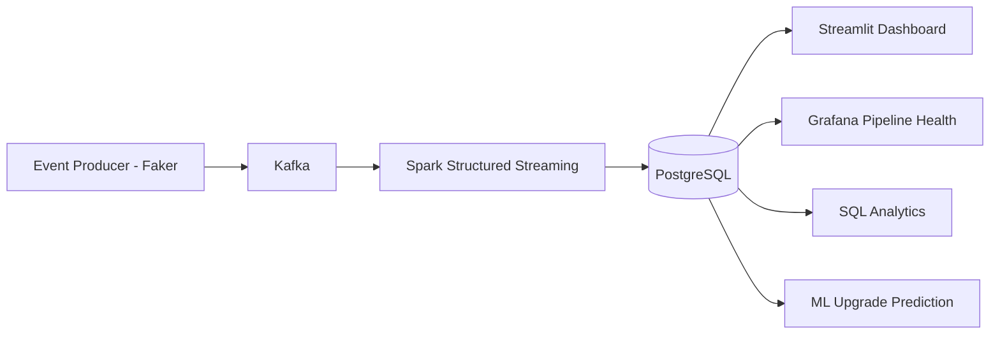

# Real-Time Streaming Analytics Platform

A production-style, real-time analytics pipeline for a SaaS company,
built end-to-end: synthetic user events are generated, streamed through
Kafka, processed in real time by Spark Structured Streaming, persisted
to PostgreSQL, and surfaced through a live Streamlit dashboard (with an
AI-powered natural-language query feature) and a Grafana operational
health monitor. SQL analytics and a machine learning model add
descriptive and predictive analytics on top of the pipeline.

This project was built incrementally, phase by phase, with each stage
verified working end-to-end before moving to the next.

## Architecture

## Tech Stack

- **Streaming**: Apache Kafka (Confluent images), Apache Zookeeper
- **Processing**: Apache Spark 3.5.1 (Structured Streaming, PySpark)
- **Storage**: PostgreSQL 15
- **Dashboards**: Streamlit + Plotly (business KPIs), Grafana (ops monitoring)
- **AI**: Anthropic Claude API (natural-language-to-SQL)
- **ML**: scikit-learn (Random Forest / Logistic Regression)
- **Infrastructure**: Docker Compose (5 services: Zookeeper, Kafka, Spark, PostgreSQL, Grafana)
- **Testing**: pytest (29 tests: unit + integration)
- **Language**: Python 3.13

## Setup & Running Locally

### Prerequisites
- Docker & Docker Compose
- Python 3.13 with venv
- ~4GB free RAM for Docker containers

### 1. Clone and install dependencies

    git clone https://github.com/nityasree03/streaming-analytics-platform.git
    cd streaming-analytics-platform
    python3 -m venv venv
    source venv/bin/activate
    pip install -r requirements.txt

### 2. Start infrastructure

    docker compose up -d

This starts 5 containers: Zookeeper, Kafka, Spark (master), PostgreSQL,
and Grafana.

### 3. Apply the database schema

    docker cp database/schema.sql streaming-postgres:/tmp/schema.sql
    docker exec -it streaming-postgres psql -U streaming_user -d streaming_analytics -f /tmp/schema.sql

### 4. Create the Kafka topic

    docker exec streaming-kafka kafka-topics --create \
      --topic user-events --bootstrap-server localhost:9092 \
      --partitions 3 --replication-factor 1

### 5. Start the event producer (Terminal 1)

    source venv/bin/activate
    python producer/kafka_producer.py

### 6. Start the Spark streaming job (Terminal 2)

    docker exec -u root streaming-spark mkdir -p /home/spark/.ivy2/cache /home/spark/.ivy2/jars /home/spark/.m2
    docker exec -u root streaming-spark chown -R spark:spark /home/spark/.ivy2 /home/spark/.m2
    docker exec -u root streaming-spark pip install psycopg2-binary

    docker exec streaming-spark /opt/spark/bin/spark-submit \
      --packages org.apache.spark:spark-sql-kafka-0-10_2.12:3.5.1,org.postgresql:postgresql:42.7.3 \
      /opt/spark-apps/streaming_job.py

### 7. View the dashboards

- **Streamlit** (business KPIs + AI query tool):

      streamlit run dashboard/app.py

  Open http://localhost:8501

- **Grafana** (pipeline health monitoring):

  Open http://localhost:3000 (login: admin / admin)

### 8. (Optional) Enable the AI natural-language query feature

    export ANTHROPIC_API_KEY="your-key-here"
    streamlit run dashboard/app.py

## Feature Walkthrough

### Streamlit Dashboard (Executive Overview)
Live-updating (5-second auto-refresh) view of pipeline throughput: total
events, latest window event count, average events/minute, and a
time-series chart of events-per-minute, backed by `aggregated_metrics`.

### AI-Powered "Ask a Question"
A natural-language interface (powered by Claude) that translates plain
English questions into read-only SQL queries, executes them against
Postgres, and displays results -- with the generated SQL shown for
transparency. Includes three layers of safety validation (see
`dashboard/README.md` for details).

### Grafana Pipeline Health Monitor
Two panels: "Seconds Since Last Pipeline Update" (a heartbeat/freshness
metric) and "Events Per Minute (Pipeline Throughput)" (a time-series
view), both backed by direct SQL queries against `aggregated_metrics`.

### SQL Analytics Suite (`database/analytics/`)
Four files of documented, interview-ready SQL covering classic SaaS KPIs:
- `01_dau_wau_mau.sql` -- Daily/Weekly/Monthly Active Users and stickiness ratio
- `02_feature_adoption.sql` -- feature usage by plan tier, adoption breadth
- `03_conversion_funnel.sql` -- signup -> feature use -> conversion funnel
- `04_retention_churn.sql` -- recency segmentation and churn signals

### Machine Learning (`ml/upgrade_prediction.py`)
A Random Forest / Logistic Regression classifier predicting whether a
user will upgrade/purchase, based on behavioral features extracted via
SQL. Includes an honest discussion of class imbalance and how
`class_weight='balanced'` affects precision/recall tradeoffs.

## Project Structure

    .
    +-- producer/           Kafka event producer + synthetic event generator
    +-- spark/               Spark Structured Streaming job
    +-- database/
    |   +-- schema.sql       Table definitions (raw_events, aggregated_metrics, etc.)
    |   +-- analytics/        SQL analytics suite (DAU/MAU, funnel, retention, etc.)
    +-- dashboard/
    |   +-- app.py           Streamlit dashboard
    |   +-- nl_to_sql.py     AI natural-language-to-SQL module
    +-- ml/
    |   +-- upgrade_prediction.py
    +-- monitoring/
    |   +-- README.md        Grafana setup and panel documentation
    +-- tests/                pytest suite (unit + integration)
    +-- docker-compose.yml
    +-- requirements.txt

## Testing

    python -m pytest -v

29 tests covering: event generator schema validation, SQL safety
validation (the AI feature's guardrails), and live integration tests
against the analytics SQL suite.

## Known Limitations & Future Work

- **Synthetic data**: events are generated by a Faker-based simulator
  with randomly assigned event types per user, not a true sequential
  user journey. This means some funnel/cohort metrics (documented inline
  in the relevant `.sql` files) can show artifacts not present in real
  product data (e.g. conversion percentages exceeding 100%).
- **Single-day dataset**: DAU/WAU/MAU are currently equal since all data
  is generated within hours; with longer-running historical data these
  would diverge meaningfully.
- **Grafana monitoring scope**: currently backed by Postgres queries only.
  A production setup would add Kafka JMX, Spark metrics, and
  container-level exporters (see `monitoring/README.md`).
- **ML model**: trained on a single snapshot with a 94.6%/5.4% class
  imbalance; a production model would need more historical data and
  richer time-series features.

## License

MIT
